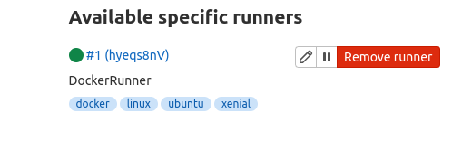

## Что было сделано

 * Создал новую ветку gitlab-ci-1
 * INPROGRESS Полез вспомнить, как создать VM из terraform
   * Сделал создание подсети на YC
   * Собрал образ с установленным docker-ом поверх ubuntu 20.04 (в папке gitlab-ci/packer)
   * Долго и нудно настраивал создание VM, чтобы создавалось и провижнилось из docker-base-app
   * Когда VM создалась, решил сначала проверить, что она действительно создалась
   * Странно, но это удалось. Хотя и только со второй попытки
   * Вообще, меня мучает мысль - возможно имело смысл вообще всё, вместе с установленным docker-compose.yml запечь прямо в образ через packer
     * (Хотя бы пакеты python3 и то, что с ним идет)
   * Осталось на завтра:
     * Получить docker-compose.yml (возможно, доработать)
     * Написать playbook, который
       * Подготовит каталоги, в которых будет работать приложение
       * Скопирует docker-compose.yml
       * Запустит docker-compose up
       * ?? возможно, нужно будет сделать это службой?
     * Скопировать действия по созданию ansible/inventory и запуску ansible/run_gitlab.yml
     * Продолжить листать методичку

## 2022.08.28 11:04
 * Будет все-таки лучше сделать packer-image с добавленным docker-compose.yml

## 2022.08.28 16:11
 * Наконец запустил docker-compose и дождался, когда он стартанет
 * (он очень нешустро это делает)
 * Нашел способ получить исходный пароль для root:
   * Здесь: `https://www.youtube.com/watch?v=F6MBLkUrIQ8`
   * `sudo docker exec -it container_name grep 'Password:' /etc/gitlab/initial_root_password`
 * Несколько офигел от отсутствия картинок в методичке
 * 3.3 Отключил возможность регистрации
 * 4.1 Интерфейс уже дико изменился. Это, в целом, не удивительно
 ...
 * 5.7 Добавил раннер. 
 * Из всего, что успел поделать вынес мысль: лучше ставить VM со 100% готовностью, иначе ждать замучаешься
 * И, да, задачи "по желанию" по этой теме делать не буду.

Ухты
`obs:branch_review:environment config contains unknown keys: only, except`
