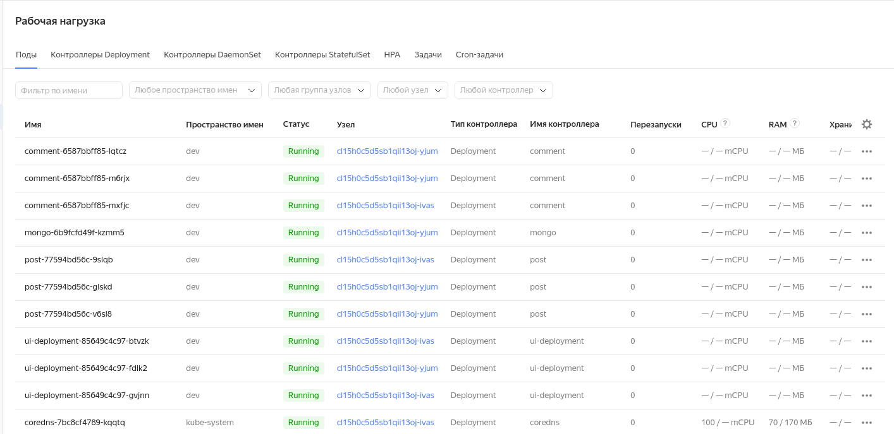

## План

 * Развернуть локальное окружение для работы с k8s
 * Развернуть k8s в yc (а предыдущий пункт зачем?)
 * Запустить reddit в k8s

## Что было сделано

### Запускаем и отлаживаем приложение локально

 * Установил kubectl в $HOME/bin
 * Версия kubectl 1.25
 * Не стал устанавливать VirtualBox (уже есть)
 * Скачал minikube-чего-то-там
 * Сделал на него линк из ~/bin/
 * Версия minikube 1.27

 * Запустил minukube start.. подождал.. ещё подождал..
 * Посмотрел на список нод по `kubectl get no[des]`

 * Заглянул в `~/.kube/config`, посчитал кластеры и контексты
 * Кажется, понял, как взаимосвязаны контексты и кластеры в конфиге

 * Подредактировал ui-deployment.yml
 * Запустил деплой приложеньки в 3 реплики
 * Дождался, когда они все запустятся
 
 * Пробросил порт из одного из трех подов на хост
 * Открыл `localhost:8080` в браузере, убедился что приложеньку видно
 
 * Начал редактировать comment-deployment.yml и тут меня надолго отвлекли

--- 12:48 01.10.2022
--- 13:59 02.10.2022

 * Запустил minukube --start, чтобы снова все поднялось
 * Обнаружил, что поды, поднятые в прошлый подход, поднялись (чем не повод для выпить?)
 * Доредактировал comment-deployment.yml, запустил через kubectl apply -f ./...
 * Проверил командой `curl http://localhost:8081/healthcheck`
 * Отредактировал post-deployment.yml, запустил через apply
 * Проверил healthcheck
 * Скопировал из gist новый mongo-deployment, в процессе отметил, что версия mongodb в этом случае указана (а не сделан latest)
 * Запустил mongo-deployment
 * Долго смотрел как он скачивается а потом запускается.

 * Создал объект comment-service
 * Посмотрел вывод `kubectl get services`, обнаружил там сервис comment.
 * Искал ошибку в своем comment-service.yml. После того, как нашел, Endpoints стали что-то содержать
 * Описал и запустил сервис post
 * Поскольку в контейнерах не было nslookup проверял доступность адреса при помощи ping <имя сервиса>, например, так:
```
❯ kubectl exec -ti ui-deployment-b56cd4bc-wfxkr -- ping post
PING post.default.svc.cluster.local (10.98.88.62) 56(84) bytes of data./post-service.yml
```

 * Добавил сервисы
   * comment-service.yml
   * post-service.yml
   * mongo-service.yml
 * Потом
   * comment-mongodb-service.yml
   * post-mongodb-service.yml

 * Потом залез в старые Dockerfile-ы и подтянул переменные окружения из них (добавил {COMMENT,POST}_DATABASE) и после этого (и порт-форвардинга), открыл приложеньку и подобавлял постов в базу
 * Удалил `mongo-service.yml` и проверил, что приложение отрабатывает
 * Добавил ui-service.yml и создал объект
 * Проверил, что minikube открывает страницу сервиса

 * Заэнэйблил dashboard в minikube, чтобы было с чем смотреть примеры
 * Посмотрел поды `kubectl get po -n kubernetes-dashboard`:
```
NAME                                         READY   STATUS    RESTARTS   AGE
dashboard-metrics-scraper-5896898794-mjbnw   1/1     Running   0          71s
kubernetes-dashboard-867758657b-qznkt        1/1     Running   0          71s
```
 * Погуглил и нашел, как открывается dashboard: `minikube dashboard`.

 * Создал новый namespace
 * Убил старые поды, поднял в `-n dev`, запустил дашбоард, поправил урл на `http://127.0.0.1:43999/api/v1/namespaces/kubernetes-dashboard/services/http:kubernetes-dashboard:/proxy/#/workloads?namespace=dev` и посмотрел на поды в другом нэймспейсе.
 * Ну и, конечно, `minikube service ui -n dev` открыл в браузере приложение в `dev`.

### Продолжаем на yandex.cloud

 * Зашел в managed kubernetes service
 * Обнаружил, что версия 1.19 больше не доступна, использовал 1.20
 * Запустил создание кластера и сел ждать [16:36]
 * [16:42] Ничоси
 * После того, как кластер развернулся, подцепился к нему командой `yc managed-kubernetes cluster get-credentials <cluster-name> --external`.
 * После этого создал в кластере namespace `dev` и уже в нем - все те же самые поды, что создавал до этого локально.
 * Командой `kubectl get nodes -o wide` получил айпишники нод
 * Командой `kubectl describe service ui -n dev | grep NodePort` получил номер порта
 * Открыл <полученный ip>:<полученный порт> и обнаружил, что приложение работает и там

 * Прикрепил картинку с веб-интерфейсом



 * Грохнул кластер

 * Так и не понял, за каким (эммм..) надом нужен был VirtualBox

## Пометки на полях

 * Почитать, что за драйвер докера overlay2


 * Контекст (конфигурация kubectl)
   * cluster (API-server)
     * server (адрес kubernetes API-сервера)
     * certificate-authority (SSL сертификат, удостоверяющий сервер)
     * name (имя для идентификации в конфиге)
   * user (пользователь для подключения к серверу)
   * namespace (область видимости)

